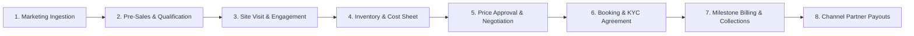

# Rise With RealtyHub — Complete Project Workflow & Architectural Guide

---

## 1. Executive Summary & Platform Purpose

**Rise With RealtyHub** is an enterprise-grade **Real Estate Revenue Operating Platform (CRM)** engineered specifically for Real Estate Developers, Builders, Property Agencies, and Broker Networks.

Unlike generic generic sales CRMs, Rise With RealtyHub addresses the **complex, multi-stage physical and financial lifecycle** unique to real estate transactions — spanning from multi-channel digital lead acquisition to pre-sales qualification, physical site visits, real-time tower inventory reservation, multi-tier discount approvals, digital application bookings, construction milestone collections, and channel partner commission settlements.



---

## 2. End-to-End CRM Lifecycle (Phase-by-Phase)

```
+---------------------------------------------------------------------------------------------------+
|                                      RISE WITH REALTYHUB CRM                                      |
+---------------------------------------------------------------------------------------------------+
  |
  +---> [Phase 1: Marketing & Inbound Ingestion]
  |     - Meta Ads, Google Search, 99acres, MagicBricks, Website Webhooks
  |     - Dynamic AI Lead Scoring (0-100) & Round-Robin Executive Assignment
  |
  +---> [Phase 2: Pre-Sales Qualification & Follow-ups]
  |     - Kanban Board with Drag-and-Drop Stage Advancement
  |     - Integrated Cloud Calling Dialer & WhatsApp Business Live Threads
  |     - SLA-driven Automated Activity Reminders & Overdue Escalations
  |
  +---> [Phase 3: Master Projects & Inventory Stacking Matrix]
  |     - Project Master Setup (Residential, Commercial, Mixed-Use)
  |     - Live Interactive 2D Stacking Matrix (Floors, Units, Facing, Super Built-Up)
  |     - 48-Hour Executive Hold vs. Instant Booking Lock
  |     - 1-Click Multi-Floor Auto-Unit Generator
  |
  +---> [Phase 4: Site Visits & Physical Tours]
  |     - GPS/Site Schedule & Real-Time Check-In / Check-Out Verification
  |     - Post-Visit Rating (1-5 Stars) & Sentiment Outcome Categorization
  |
  +---> [Phase 5: Pricing Engine, Cost Sheets & Commercial Negotiation]
  |     - Automated Cost Sheet Generator (BSP, Floor Rise, PLC, Parking, GST, Stamp Duty)
  |     - Price Exception Approval Matrix (Multi-Level Sales Head / VP Sales Escalation)
  |
  +---> [Phase 6: Digital Booking & Application Agreement]
  |     - Token Cheque / Online Payment Gateway Verification
  |     - Digital KYC (PAN, Aadhaar) & Builder-Buyer Agreement Generation
  |     - Unit Status Lock: 'Available' -> 'Booked' / 'Sold'
  |
  +---> [Phase 7: Construction-Linked Milestone Billing & Collections]
  |     - Demand Notice Dispatch (Foundation, Plinth, 5th Slab, Finishing)
  |     - Payment Recording, NEFT/Cheque Reconciliation & Money Receipts
  |
  +---> [Phase 8: Channel Partner (Broker) Network & Payouts]
  |     - RERA Broker KYC & Tier Slabs (Silver 2.0%, Gold 2.5%, Platinum 3.0%)
  |     - Automated Sourced Sales Attribution & Commission Settlement
+---------------------------------------------------------------------------------------------------+
```

---

## 3. Detailed Module Breakdown & Standard Operating Procedures (SOP)

### Module 1: Leads & Pre-Sales Pipeline (`/leads`)
* **Objective**: Ingest inbound buyer inquiries, score lead intent, and advance opportunities through pre-sales stages.
* **Key Features**:
  1. **Dual View Options**: Instant toggle between **Data Grid View** (with batch operations and export) and **Interactive Kanban View**.
  2. **HTML5 Drag-and-Drop**: Drag any buyer card across pipeline stages (`New` -> `Contacted` -> `Connected` -> `Qualified` -> `Site Visit Scheduled` -> `Negotiation` -> `Booked` -> `Lost`).
  3. **Visual Drop Targets**: Drop target column highlights dynamically with dashed primary borders and instant state synchronization.
  4. **Right-to-Left Slide Drawer**: Clicking any lead slides out a dedicated drawer displaying communication timeline, lead scoring bar, verified qualification notes, and one-click Calling / WhatsApp buttons.
  5. **Data Protection**: Edit modal and Delete actions with safety confirmation dialogs.

---

### Module 2: Projects & Live Inventory Stacking Matrix (`/projects` & `/inventory`)
* **Objective**: Provide architectural hierarchy of real estate developments and real-time live availability of units.
* **Key Features**:
  1. **Master Projects Directory**: Displays total units, active towers, launched inventory, live occupancy %, and revenue targets.
  2. **1-Click Floor Generator (`⚡ Auto-Generate Floors`)**: Generates 20 units across 5 floors with randomized typologies (2BHK, 3BHK, 4BHK) and pricing configurations instantly for rapid development setup.
  3. **Unit Addition**: Slide modal to add custom flats, penthouses, or commercial office suites.
  4. **Interactive Stacking Matrix (`/inventory/matrix`)**:
     * **Green**: Available for purchase.
     * **Amber**: On 48-Hour Executive Hold.
     * **Blue**: Booked with token amount paid.
     * **Purple**: Sold & registered.
     * **Gray**: Blocked by developer.
  5. **Unit Action Drawer**: Reserve 48-Hour Hold, Release Hold, Generate Cost Sheet, or Permanently Delete Unit.

---

### Module 3: Dynamic Pricing & Cost Sheet Calculator (`/pricing/calculator`)
* **Objective**: Generate precise, transparent RERA-compliant buyer cost breakdowns.
* **Component Math**:
  $$\text{Agreement Value (AV)} = (\text{Super Built-Up Area} \times \text{Base Price}) + \text{Floor Rise} + \text{PLC} + \text{Car Parking}$$
  $$\text{Statutory Charges} = \text{GST (5\%)} + \text{Stamp Duty (6\%)} + \text{Registration (1\%)}$$
  $$\text{All-Inclusive Total} = \text{AV} + \text{Statutory Charges} + \text{Possession & Infrastructure Maintenance Sinking Fund}$$

---

### Module 4: Price Exceptions & Commercial Approvals (`/negotiations`)
* **Objective**: Prevent unauthorized discounting while empowering sales reps to request controlled deal closures.
* **Approval Hierarchy Policy**:
  * **0% – 2.0% Discount**: Sales Manager instant approval.
  * **2.1% – 4.0% Discount**: VP Sales authorization required.
  * **4.1%+ Discount**: Managing Director approval required.
* **Workflow**:
  1. Closer rep raises request specifying unit number, requested agreement value, and customer justification.
  2. Sales heads review pending requests in table/drawer.
  3. Clicking **Approve** unlocks the revised price in the cost sheet generator; **Reject** logs reason in audit log.

---

### Module 5: Site Visits & Property Tours (`/site-visits`)
* **Objective**: Track physical visitor footfall, assign site relationship managers, and record immediate purchase intent.
* **Workflow**:
  1. Pre-sales schedules visit with buyer name, date, time slot, and assigned executive.
  2. Visitor check-in on site via **Check In** button.
  3. Post-tour check-out records **Outcome** (`Negotiation`, `Ready to Book`, `Follow-up Required`) and 1-5 Star satisfaction rating.

---

### Module 6: Booking & Application Deeds (`/booking`)
* **Objective**: Finalize unit reservation and initiate legal builder-buyer agreements.
* **Workflow**:
  1. Closer rep inputs customer PAN, Aadhaar, selected unit, total consideration, and token advance paid.
  2. Automatic application generation `#BK-2026-XXX`.
  3. System automatically transitions unit status to `booked`, locks it out of other sales reps' matrices, and creates payment schedule records.

---

### Module 7: Demand Notices & Collections (`/payments`)
* **Objective**: Manage construction-linked payment schedules and generate official money receipts.
* **Milestone Schedule**:
  * *10% Advance Token on Application*
  * *20% Completion of Plinth Work*
  * *25% Casting of 5th Floor RCC Slab*
  * *25% Completion of Brickwork & Internal Plaster*
  * *15% External Painting & Lift Installation*
  * *5% Handover & Possession Clearance*
* **Collection Action**: Record payment method (NEFT, RTGS, Cheque, UPI), transaction reference ID, issuing bank, and auto-generate stamped Money Receipts.

---

### Module 8: Channel Partner Network & Commission Settlement (`/channel-partners`)
* **Objective**: Manage external broker agencies, RERA licenses, lead attribution, and tiered commission payouts.
* **Tiered Slabs**:
  * **Silver Partner (< 5 Cr Sales)**: 2.0% Commission.
  * **Gold Partner (5 – 15 Cr Sales)**: 2.5% Commission.
  * **Platinum Partner (> 15 Cr Sales)**: 3.0% Commission.
* **Features**: Dedicated QR codes for partner-sourced buyer tagging, invoice submission, and milestone-linked payout status tracking.

---

## 4. User Roles & Permission Matrix (RBAC)

Rise With RealtyHub enforces strict Role-Based Access Control:

| Capability / Module | Administrator | VP Sales / Director | Sales Manager | Closer Rep | Pre-Sales Rep | Channel Partner |
| :--- | :---: | :---: | :---: | :---: | :---: | :---: |
| **View All Organization Leads** | Yes | Yes | Yes (Team) | Assigned Only | Assigned Only | Sourced Only |
| **Drag & Drop Stage Pipeline** | Yes | Yes | Yes | Yes | Yes | No |
| **Add / Auto-Generate Units** | Yes | Yes | Yes | No | No | No |
| **Place 48-Hour Unit Hold** | Yes | Yes | Yes | Yes | No | No |
| **Approve Discount Exceptions** | Yes | Yes (>4%) | Yes (up to 2%) | No | No | No |
| **Confirm Site Tour Check-ins** | Yes | Yes | Yes | Yes | Yes | No |
| **Approve Application Bookings** | Yes | Yes | Yes | No | No | No |
| **Record Payment Collections** | Yes | Yes | Yes (Accounts) | No | No | No |
| **Delete Records Across Pages** | Yes | Yes | No | No | No | No |
| **System Settings & Webhooks** | Yes | No | No | No | No | No |

---

## 5. UI Architecture & Design Standards

1. **Fixed Viewport & Inline Scrolling**:
   * Layout is locked to `100vh` without outer page bounce or unwanted scrollbars.
   * Navigation Sidebar and Topbar remain permanently anchored.
   * Data tables, Kanban columns, and inventory matrices scroll strictly inline within their containers.
2. **Right-to-Left Slide Drawers**:
   * All detail sheets, lead profiles, unit specifications, and edit modals open smoothly as right-to-left slide drawers (`.drawer`) with fixed headers, fixed footers, and backdrop scroll locks.
3. **Full CRUD Everywhere**:
   * Every manual data entry screen provides **Create (`+ New`)**, **Read / Filter**, **Update (`Edit`)**, and **Delete (`Trash2` with safety confirm)**.
4. **Light Modern Theme**:
   * Clean `#ffffff` canvas with slate typography (`#0f172a`), subtle dividers (`#e2e8f0`), and soft primary blue interactive highlights (`#2563eb` / `#eff6ff`).
